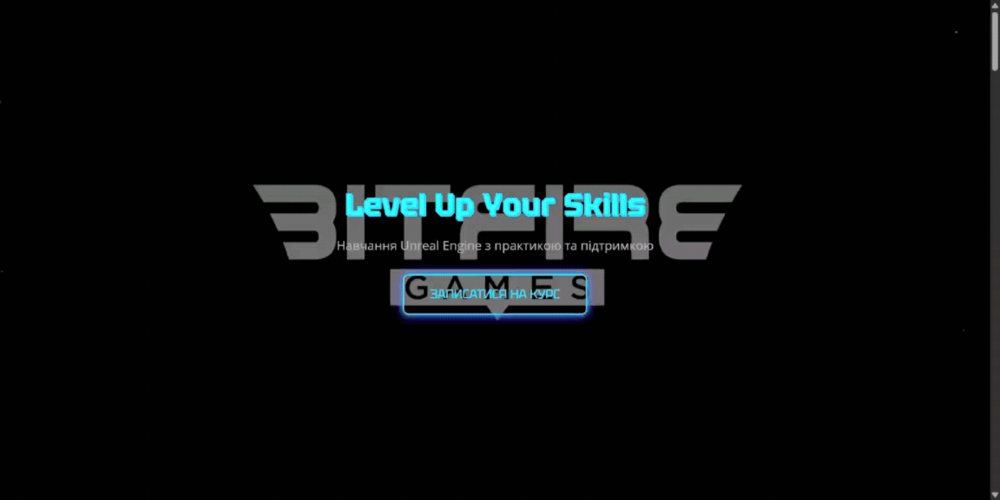

# 🚀 Unreal Engine Course Landing Page

A landing page for enrolling in the **Unreal Engine Course**, designed with modern animations, interactive features, and full responsiveness.

## 🎯 Project Goal
This website is not just informative — it is built to inspire users to join the course. With smooth scroll animations, adaptive design, and an active registration form, it feels like a professional promo page.

## ✨ Key Features
- 🔥 Dynamic **scroll animations** for a modern web experience
- 🎨 **Custom design** created from scratch
- 🖥️ Built with **HTML, CSS, JavaScript**
- 📝 **Registration form** with validation and interactive effects
- 📱 **Mobile version & responsive design** — optimized for smartphones and tablets

## 📸 Visuals


## 🚀 How to Run
1. Clone the repository:
   ```bash
   git clone https://github.com/1Oleksandra/unreal-angel-landing-page.git
Open index.html in your browser.

Explore animations, test the registration form, and check responsiveness.

🛠️ Technologies
HTML5

CSS3 (Flexbox, animations, gradients, media queries)

JavaScript (DOM, events, validation)


📧 Contact
💌 <a href="mailto:olexsandrapavlenko@gmail.com">olexsandrapavlenko@gmail.com</a> <br>
  🔵 <a href="https://t.me/Oleksandra_Pavlenko1">Telegram: Oleksandra_Pavlenko1</a> <br>
  🟢 <a href="https://wa.me/905068329056">WhatsApp: Oleksandra</a> <br>
  💼 <a href="https://linkedin.com/in/olesya-dev](https://www.linkedin.com/in/%D0%BE%D0%BB%D0%B5%D0%BA%D1%81%D0%B0%D0%BD%D0%B4%D1%80%D0%B0-%D0%BF%D0%B0%D0%B2%D0%BB%D0%B5%D0%BD%D0%BA%D0%BE-59759098">LinkedIn</a> <br>
